# Azure Monitoring & Observability: HA Web Infrastructure

**Author:** Maurrin Carter  
**Technologies:** Azure Monitor, Log Analytics (KQL), Azure Monitor Agent (AMA), Data Collection Rules (DCR), Grafana, Prometheus  

---

## Project Overview

This project demonstrates a production-grade monitoring and observability architecture built on Microsoft Azure. It covers the end-to-end configuration of Azure Monitor, Log Analytics, and Grafana to track the health, availability, and real-time performance of a high-availability web infrastructure.

---

## Architecture & Infrastructure Summary

| Resource | Resource Name / Details | Purpose |
|---|---|---|
| **Resource Group** | `ha-web-infrastructure-rg` | Primary resource boundary |
| **Virtual Machines** | `vm-web-01`, `vm-web-02`, `vm-db-01`, `vm-db-02` | High-availability compute tier |
| **Load Balancer** | `ha-load-balancer` | Traffic distribution and health probing |
| **Log Analytics** | `ha-web-logs` | Centralized telemetry, logs, and query engine |
| **Data Collection** | `ha-linux-dcr` (DCR) | Ingestion rules for Syslog, Perf, and Heartbeats |

---

## 1. Azure Monitor & Agent Configuration

The virtual machines were configured with the **Azure Monitor Linux Agent (AMA)** and onboarded via System-Assigned Managed Identities. A **Data Collection Rule (DCR)** was provisioned in `eastus2` to route performance metrics, syslog streams, and agent heartbeats directly to `ha-web-logs`.

### Resource Group Overview
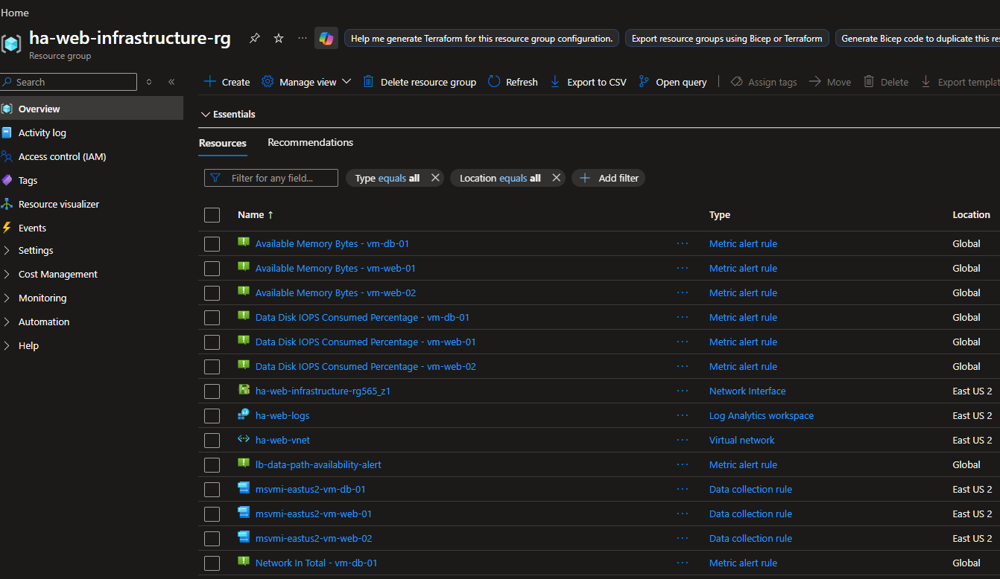
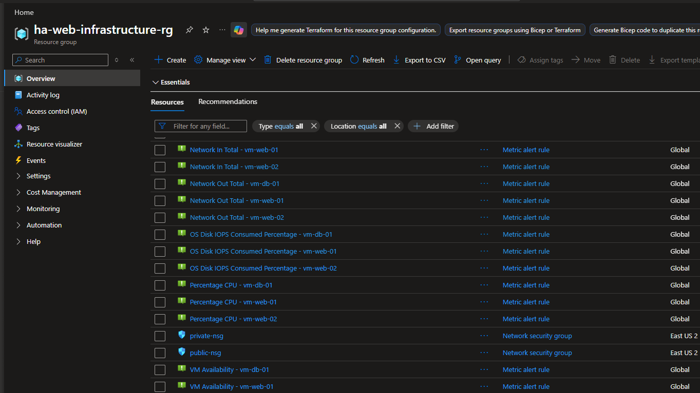
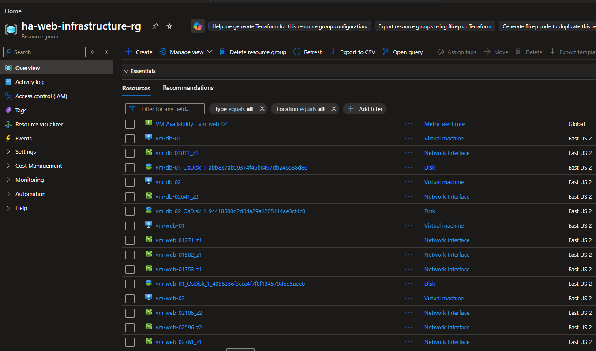
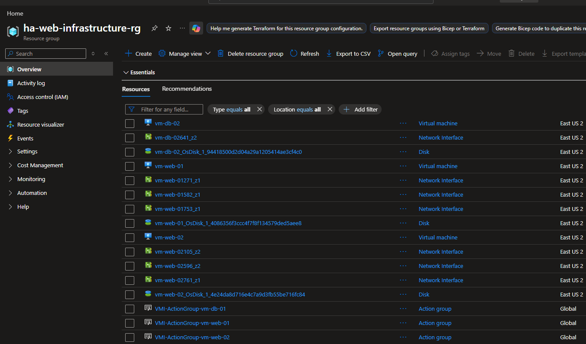

### Agent & Data Collection Configuration
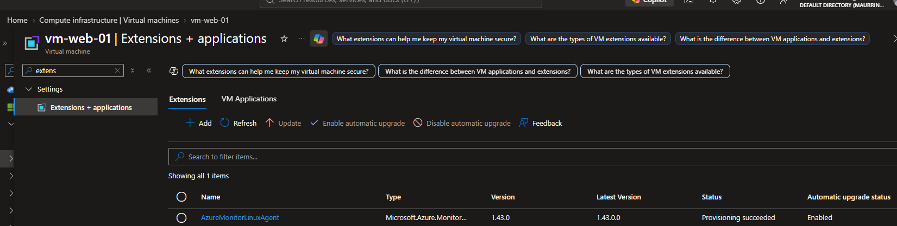
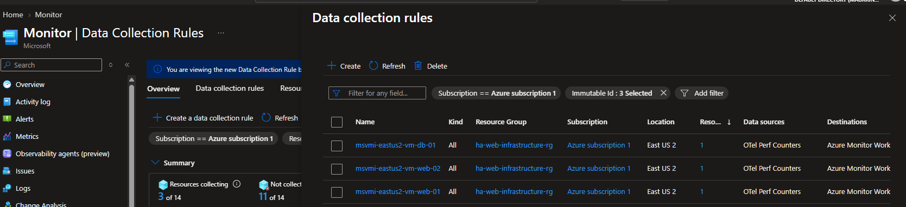
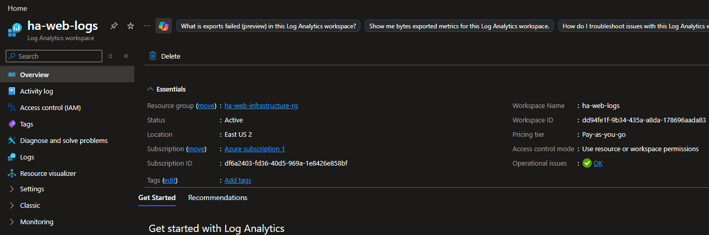

---

## 2. Alert Rules & Action Groups

Alerting policies were established to catch infrastructure bottlenecks. Static and dynamic thresholds were paired with dedicated Action Groups to deliver automated notifications upon threshold breach.

### Alert Rule Definitions
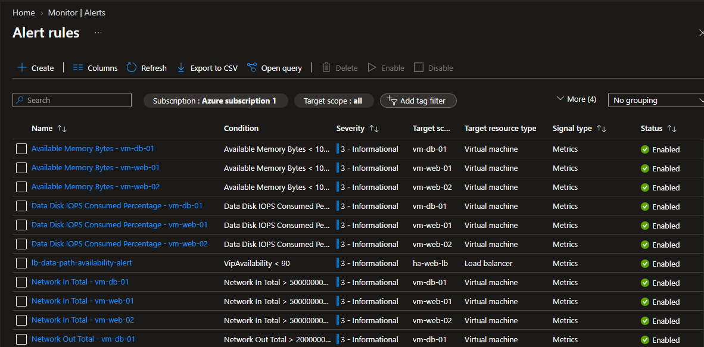
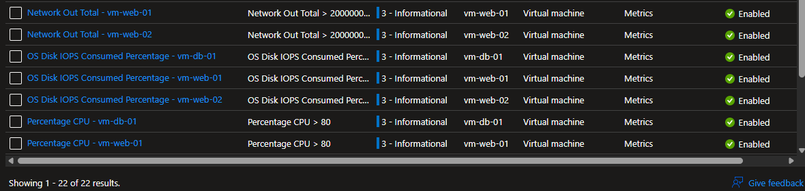
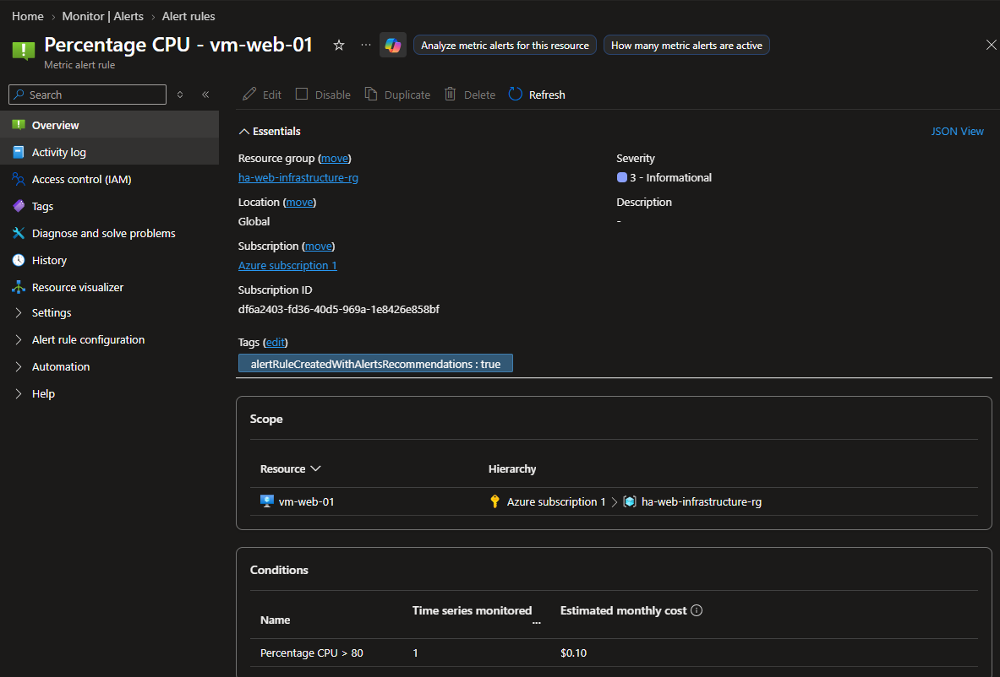

### Action Groups & Notification Delivery
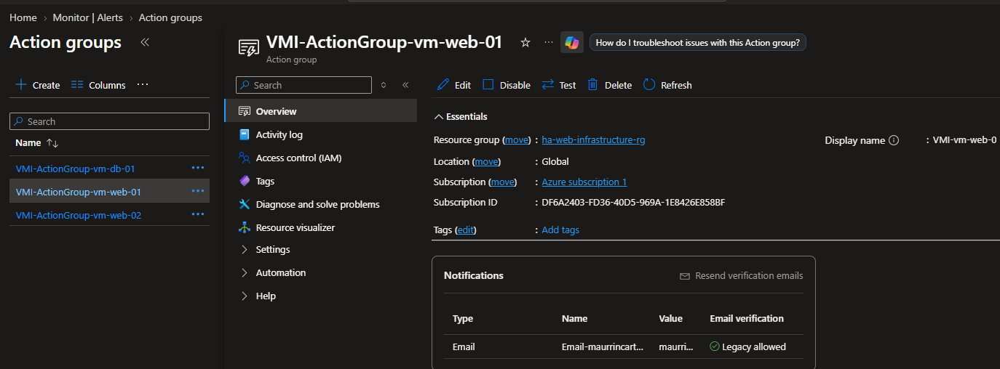
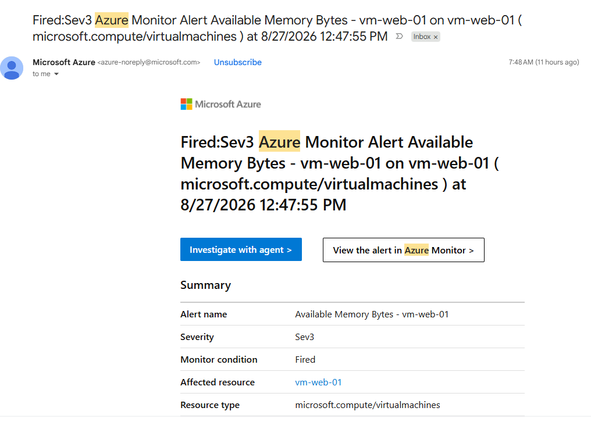
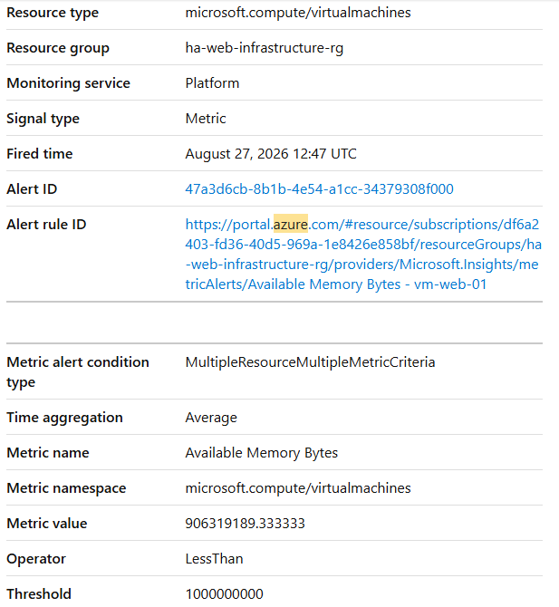
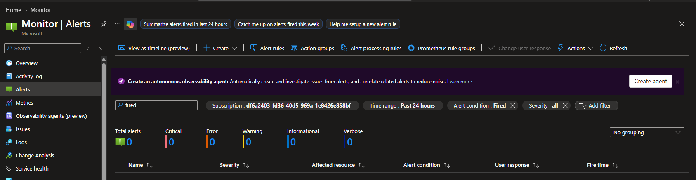

---

## 3. Log Analytics & Key KQL Queries

Log Analytics was used to execute KQL queries against the `Heartbeat`, `Perf`, and `Syslog` tables for operational validation.

### 1. Active Heartbeat Check
```kql
Heartbeat
| summarize arg_max(TimeGenerated, *) by Computer
| project Computer, OSType, Version, RemoteIPCountry, TimeGenerated
| order by TimeGenerated desc
